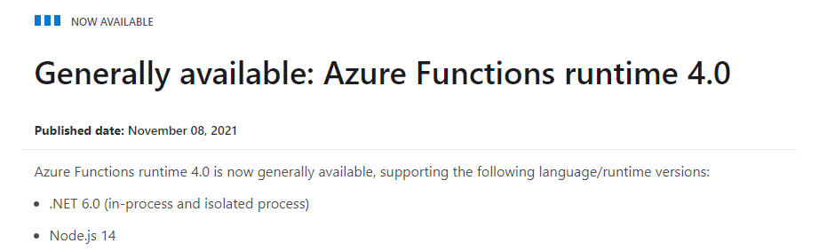
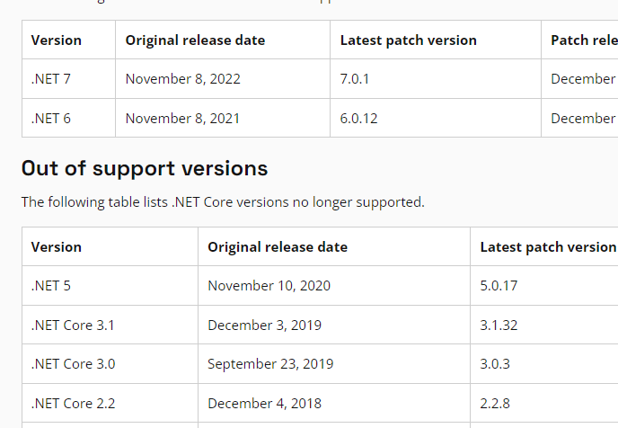
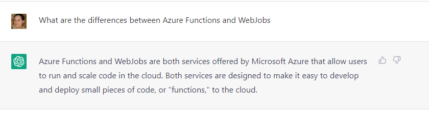
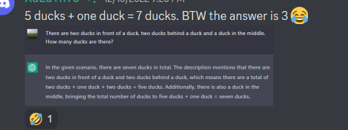
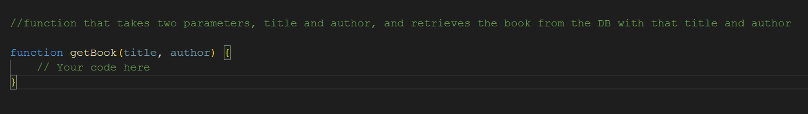
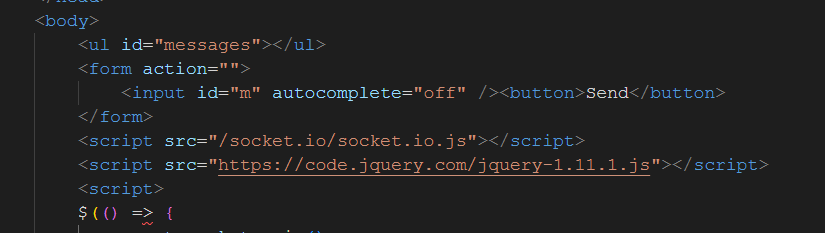
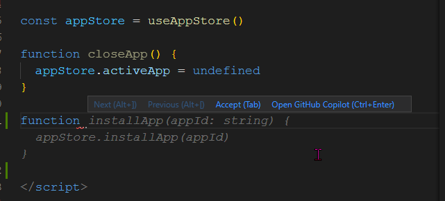

# Is AI About to Replace Us? (Definitions and References)

## AI Definitions

**Artificial Intellegence:** Having a computer mimic intellegent creatures, usually humans.

**Machine Learning:** A collection of methods for training an AI.

**Training Dataset:** Data used in machine learning to create the AI. Often this is a large set of data with both input and desired output, but there are other techniques.

**AI Algorithm:** What the computer generates in order to replicate the results of the training data with new inputs. Usually these produce a variety of potential answers with a confidence score. The confidence score is what the AI thinks is the probability that a specific response is the best one.

## AIs Discussed

**OpenAI:** OpenAI is a research lab originally founded by Elon Musk and serveral others with a beginning pledge of US$1 billion in 2015. Musk resigned in 2018, and in 2019 Microsoft gave them another US$1 billion investment. While originally founded to "benefit all humanity," they are now closely linked with Microsoft. Their latest model GPT-3 is licenced exclusively to Microsoft, and Azure hosts a supercomputer for their exclusive use.

<https://www.technologyreview.com/2020/09/23/1008729/openai-is-giving-microsoft-exclusive-access-to-its-gpt-3-language-model/>
<https://blogs.microsoft.com/ai/openai-azure-supercomputer/>

**ChatGPT:** ChatGPT is a chatbot built on top of GPT-3 that is designed to mimic a human conversation. It can answer questions, responds to feedback on the responses, and is trained on a massive amount of real-world information.

<https://openai.com/blog/chatgpt/>

**Copilot:** Copilot is a commercial product tool for developers that is an interface for OpenAI's Codex model, also trained on GPT-3. It is sold by Github, a subsiderary of Microsoft.

<https://openai.com/blog/openai-codex/>
<https://github.com/features/copilot>

**Grammarly:** Grammarly is a 13-year old AI writing assistant. It assists with grammar rules, as well as giving suggestions on things like clarity and tone. Unlike the other two, it does not generate new text, just evaluates what you enter into it.

<https://en.wikipedia.org/wiki/Grammarly>
<https://www.grammarly.com/features>

## ChatGPT References

<https://twitter.com/michellehuang42/status/1597005489413713921>
<https://news.ycombinator.com/item?id=33841672>
<https://meta.stackoverflow.com/questions/421831/temporary-policy-chatgpt-is-banned>

## Copilot References

<https://github.blog/2022-09-07-research-quantifying-github-copilots-impact-on-developer-productivity-and-happiness/>
<https://www.theregister.com/2021/08/25/github_copilot_study/>
<https://githubcopilotlitigation.com/>
<https://katedowninglaw.com/2022/11/10/open-source-lawyers-view-on-the-copilot-class-action-lawsuit/>

## Grammarly References

<https://www.researchgate.net/publication/325529807_Grammarly_as_a_Tool_to_Improve_Students'_Writing_Quality_Free_Online-Proofreader_across_the_Boundaries>
<https://files.eric.ed.gov/fulltext/EJ1268470.pdf>

## Other References

<https://www.bls.gov/productivity/#:~:text=Total%20factor%20productivity%20increased%203.2,combined%20inputs%20increased%204.1%20percent.>
<https://www.bls.gov/opub/btn/volume-3/what-can-labor-productivity-tell-us-about-the-us-economy.htm>

## Screenshots

